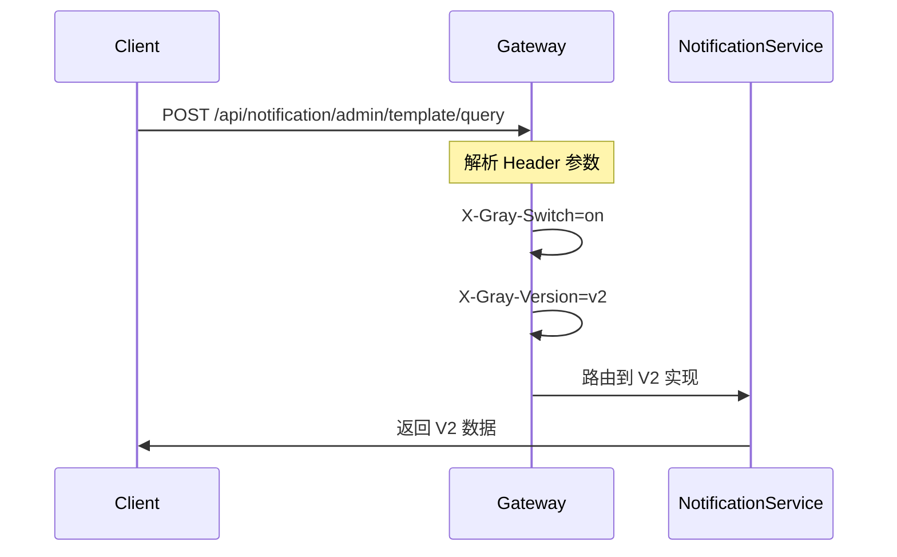

# 灰度发布使用文档

## 1. 概述

灰度发布（灰度发布）是一种软件发布策略，允许新版本功能仅对特定用户群体开放，降低全量发布风险。

## 2. 灰度方案

### 2.1 灰度策略

| 策略 | 说明 |
|------|------|
| Header 染色 | 通过 HTTP Header 传递灰度信息 |
| 用户列表 | 支持多用户灰度，用逗号分隔 |

### 2.2 灰度参数

| Header 名称 | 类型 | 说明 | 示例 |
|------------|------|------|-------|
| X-Gray-Switch | String | 灰度开关 | on/off |
| X-Gray-Version | String | 目标版本 | v1/v2 |
| X-Gray-Users | String | 灰度用户 ID 列表 | user123,user456 |

## 3. 网关路由

### 3.1 路由规则

```yaml
routes:
  # 通知模板 V1 路由 (默认)
  - id: notification-v1
    uri: lb:notification-server
    predicates:
      - Path=/api/notification/admin/template/**
        Header=X-Gray-Switch, "!on"  # 未开启灰度或关闭灰度

  # 通知模板 V2 路由
  - id: notification-v2
    uri: lb:notification-server
    predicates:
      - Path=/api/v2/notification/admin/template/**
```

### 3.2 路由优先级

```
请求路径优先级：
1. /api/v2/notification/admin/template/**  → V2 版本
2. /api/notification/admin/template/** + X-Gray-Switch=on → V2 版本
3. /api/notification/admin/template/** → V1 版本 (默认)
```

## 4. 接口变更

### 4.1 V1 接口

| 方法 | 路径 | 说明 |
|------|------|------|
| POST | /api/notification/admin/template/query | 模板列表查询 |
| GET | /api/notification/admin/template/{id} | 模板详情 |
| POST | /api/notification/admin/template | 创建模板 |
| PUT | /api/notification/admin/template/{id} | 更新模板 |
| DELETE | /api/notification/admin/template/{id} | 删除模板 |

### 4.2 V2 接口

| 方法 | 路径 | 说明 |
|------|------|------|
| POST | /api/v2/notification/admin/template/query | 模板列表查询 |
| GET | /api/v2/notification/admin/template/{id} | 模板详情 |
| POST | /api/v2/notification/admin/template | 创建模板 |
| PUT | /api/v2/notification/admin/template/{id} | 更新模板 |
| DELETE | /api/v2/notification/admin/template/{id} | 删除模板 |

## 5. 使用方式

### 5.1 基础灰度请求

```bash
curl -X POST http://localhost:9201/api/notification/admin/template/query \
  -H "X-Gray-Switch: on" \
  -H "X-Gray-Version: v2" \
  -H "Authorization: Bearer <token>"
```

### 5.2 用户染色灰度

```bash
curl -X POST http://localhost:9201/api/notification/admin/template/query \
  -H "X-Gray-Switch: on" \
  -H "X-Gray-Version: v2" \
  -H "X-Gray-Users: user123,user456" \
  -H "Authorization: Bearer <token>"
```

### 5.3 灰度参数说明

| 参数 | 说明 |
|------|------|
| X-Gray-Switch | 灰度开关 |
| X-Gray-Version | 目标版本号 |
| X-Gray-Users | 灰度用户列表 |

## 6. 灰度流程



## 7. 注意事项

| 项目 | 说明 |
|------|------|
| 路由优先级 | 路径匹配优先于 Header 匹配 |
| 默认版本 | 未开启灰度时默认走 V1 |
| 跨版本兼容 | V1/V2 返回数据格式保持兼容 |
| 灰度开关 | 仅影响通知模板模块 |

## 8. 常见问题

### Q: 灰度开关和路径同时满足时优先哪个？
A: 路径优先。

### Q: 如何回滚灰度？
A: 设置 X-Gray-Switch=off 或修改路由配置。

### Q: 支持哪些用户范围？
A: 目前仅支持通知模板模块。
